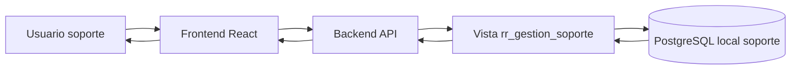
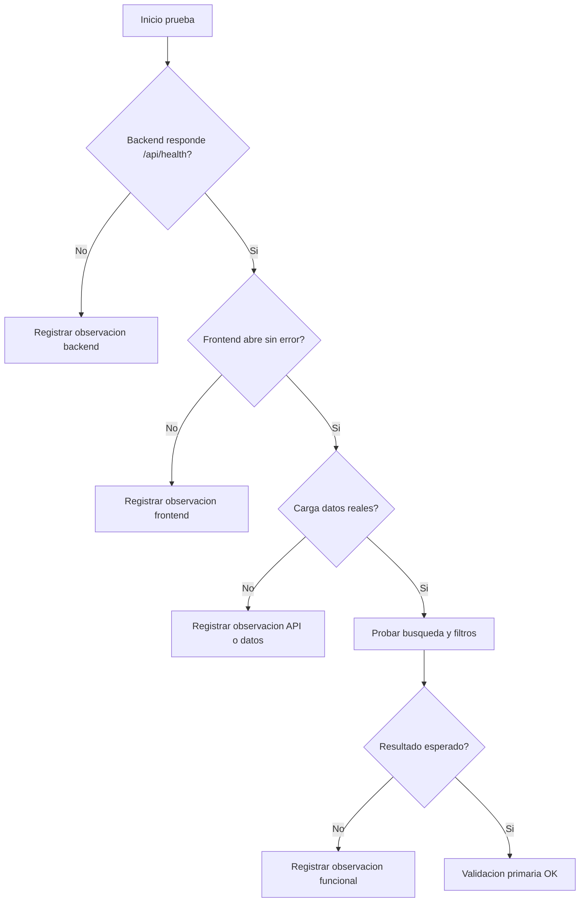

# Manual usuario primario

## Objetivo

Guiar la primera validacion funcional del sistema C2C Soporte con frontend y backend funcionando en conjunto.

Este documento sirve para:

- Entender que accion realiza cada pantalla inicial.
- Ejecutar una prueba local ordenada.
- Comparar el resultado esperado contra el comportamiento real.
- Registrar observaciones para decidir el siguiente ajuste.

## Herramienta recomendada

Usar este manual como documento Markdown en VS Code o GitHub.

Motivo:

- Permite actualizarlo junto al codigo.
- Permite revisar diagramas Mermaid.
- Permite versionar observaciones y cambios.
- Puede exportarse despues a HTML, PDF o DOCX si se necesita entregar a usuarios finales.

## Alcance actual

La primera version cubre el flujo:

```txt
Empresa -> Dispositivos
```

Pantalla:

```txt
Frontend: Vista Empresa / Dispositivos
```

API usada:

```txt
GET /api/support/company-devices
```

Fuente local:

```txt
rr_gestion_soporte.empresa_dispositivo_resumen
```

## Flujo general



## Preparacion local

### 1. Verificar base local

La base local esperada es:

```txt
Host: localhost
Puerto: 5434
Base: soporte
Usuario: postgres
```

Resultado esperado:

- La base `soporte` existe.
- Las vistas `rr_gestion_soporte` ya fueron creadas.
- La vista `empresa_dispositivo_resumen` responde con datos.

### 2. Levantar backend

Ubicarse en:

```powershell
cd C:\RODPROJECTSCODEX\workspace\c2c-soporte\backend
```

Ejecutar:

```powershell
npm run dev
```

Resultado esperado:

- Backend levantado en `http://localhost:3000`.
- Healthcheck disponible en `http://localhost:3000/api/health`.

Validacion rapida:

```powershell
Invoke-RestMethod http://localhost:3000/api/health
```

Se espera una respuesta con:

```txt
ok: true
status: ok
service: c2c-soporte-backend
```

### 3. Levantar frontend

Abrir otra terminal y ubicarse en:

```powershell
cd C:\RODPROJECTSCODEX\workspace\c2c-soporte\frontend
```

Ejecutar:

```powershell
npm run dev
```

Resultado esperado:

- Vite levanta el frontend.
- La terminal muestra una URL local, normalmente `http://localhost:5173`.
- El frontend usa proxy hacia `http://localhost:3000` para llamadas `/api`.

## Validacion funcional primaria

### Caso 1 - Carga inicial

Accion:

- Abrir el frontend en el navegador.

Resultado esperado:

- Se muestra la pantalla inicial de soporte.
- Se ven tarjetas de resumen.
- Se ve una tabla/listado de empresas y dispositivos.
- No aparece mensaje de error.

Observacion a registrar si falla:

```txt
Fecha/hora:
URL:
Mensaje visible:
Consola navegador:
Terminal backend:
Terminal frontend:
```

### Caso 2 - Filtro por texto

Accion:

- Escribir parte del nombre o RUT de una empresa en el buscador.

Resultado esperado:

- El listado se reduce segun el texto ingresado.
- Los conteos visibles se actualizan de acuerdo al resultado filtrado.
- Si no hay coincidencias, se muestra estado vacio claro.

### Caso 3 - Filtro por estado

Accion:

- Cambiar el filtro de estado de dispositivo.

Resultado esperado:

- El listado muestra solo registros del estado seleccionado.
- La seleccion puede volver a mostrar todos los registros.
- No se pierde el texto de busqueda si ya estaba escrito.

### Caso 4 - Revision de datos de una empresa

Accion:

- Buscar una empresa conocida.
- Revisar sus dispositivos asociados.

Resultado esperado:

- La empresa aparece si existe en la vista local.
- Los dispositivos aparecen asociados a la empresa correcta.
- Si la empresa no tiene dispositivos, debe poder identificarse sin romper la pantalla.

## Matriz de comportamiento esperado

| Elemento | Accion del usuario | Resultado esperado | Observacion |
| --- | --- | --- | --- |
| Carga inicial | Abrir frontend | Muestra datos reales desde backend | Registrar si hay error de conexion |
| Busqueda | Escribir empresa o RUT | Filtra resultados | Registrar busquedas que no coincidan con datos esperados |
| Estado | Seleccionar estado | Filtra dispositivos | Confirmar nombres de estados reales |
| Tabla/listado | Revisar filas | Datos legibles y sin cortes visuales | Registrar columnas faltantes |
| Backend | Consultar healthcheck | `ok: true` | Si falla, revisar `.env` y base local |

## Diagrama de validacion



## Formato de observaciones

Usar este formato cuando encuentres algo raro:

```txt
Fecha:
Ambiente: local
Pantalla:
Accion realizada:
Resultado obtenido:
Resultado esperado:
Evidencia:
Impacto:
Sugerencia o duda:
```

Ejemplo:

```txt
Fecha: 2026-05-15
Ambiente: local
Pantalla: Empresa / Dispositivos
Accion realizada: Buscar empresa por RUT
Resultado obtenido: No aparecen resultados
Resultado esperado: Aparece la empresa buscada
Evidencia: Captura o texto exacto
Impacto: No permite validar dispositivos de esa empresa
Sugerencia o duda: Revisar si el RUT viene con puntos, guion o digito verificador
```

## Criterios para continuar

Podemos avanzar al siguiente modulo si:

- Backend y frontend levantan sin errores.
- La pantalla consume datos reales.
- La busqueda funciona.
- El filtro por estado funciona.
- No hay errores visibles en consola del navegador.
- Las observaciones registradas no bloquean el flujo base.

Si aparece una observacion bloqueante, se debe revisar antes de continuar con nuevas pantallas.

## Siguiente evolucion del manual

Cuando agreguemos mas pantallas, este manual debe crecer por modulos:

- Empresas.
- Tenant.
- Device registration key.
- Documentos.
- Indicadores DTE.
- Torre de Control.

Cada modulo debe mantener:

- Accion del usuario.
- Resultado esperado.
- API involucrada.
- Datos origen.
- Checklist de prueba.
- Observaciones conocidas.
